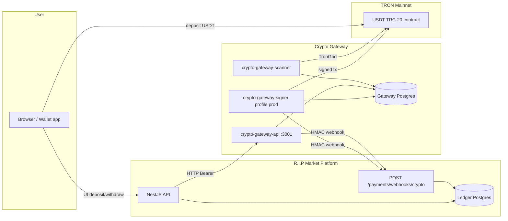

# USDT TRC-20 Payments (Crypto Tunnel)

v2 closed beta: пополнение и вывод **только** через USDT TRC-20 на TRON mainnet.  
Платформа не хранит MNEMONIC — on-chain операции выполняет отдельный **crypto-gateway**.

## Архитектура



### Разделение ответственности

| Слой | Источник правды | Роль |
|------|-----------------|------|
| **Ledger (platform)** | Баланс для сделок | DEPOSIT, HOLD, SETTLE, REFUND, WITHDRAW |
| **Gateway DB** | On-chain tx | detected → credited, withdrawal payout |
| **Signer** | MNEMONIC | Только payouts + sweep; scanner/API seed не видят |

Политика валют: **1 USDT = 1 USD** в ledger (minor = центы). Конверсия sun→minor: `minor = sun / 10_000`.

---

## Потоки

### Deposit

1. Пользователь открывает **Кошелёк** → `GET /wallet/deposit` → platform вызывает gateway `POST /v1/users` (idempotent) → постоянный TRC-20 адрес.
2. Пользователь отправляет **только USDT TRC-20** на этот адрес (mainnet, контракт из `USDT_CONTRACT`).
3. **scanner** обнаруживает tx, ждёт `MIN_CONFIRMATIONS`, помечает payment `credited`.
4. Gateway шлёт webhook `deposit.credited` → platform `PaymentsService.handleWebhook`:
   - `PaymentEvent` по `providerEventId` (идемпотентно),
   - `ledger.deposit()` с `idempotencyKey: crypto:deposit:{txHash}`.
5. UI poll `GET /wallet/deposit/status` или обновление баланса.

Gateway **не** делает hold/escrow — только зачисление.

### Withdrawal

1. `POST /wallet/withdrawals` — валидация TRC-20 адреса, min, balance, steam link, guards (daily cap, manual review).
2. `PENDING_REVIEW` → freeze в ledger; auto-approve path → сразу `APPROVED`.
3. Admin `POST /admin/withdrawals/:id/approve` → `ledger.withdraw()` → gateway `POST /v1/withdrawals`.
4. **signer** (prod profile) подписывает on-chain transfer → webhook `withdrawal.paid` / `withdrawal.failed`.
5. Platform обновляет `WithdrawalRequest` → `PAID` / `FAILED` (+ refund ledger при fail).

---

## Переменные окружения

### Platform (`backend/.env` staging)

| Variable | Staging | Описание |
|----------|---------|----------|
| `PAYMENT_PROVIDER` | `crypto_tron` | Включить crypto payments |
| `ENABLE_MOCK_DEPOSIT` | `false` | Mock deposit → 403 |
| `CRYPTO_GATEWAY_URL` | `http://crypto-gateway-api:3001` | Внутри Docker network |
| `CRYPTO_GATEWAY_API_KEY` | shared secret | Bearer для gateway API |
| `CRYPTO_GATEWAY_WEBHOOK_SECRET` | shared secret | HMAC webhook |
| `MIN_DEPOSIT_MINOR` | `500` | Мин. пополнение (центы) |
| `MIN_WITHDRAW_MINOR` | `2000` | Мин. вывод |
| `WITHDRAW_FEE_MINOR` | `200` | Комиссия платформы |
| `WITHDRAW_MANUAL_REVIEW` | `true` | Ручная модерация |
| `WITHDRAW_MANUAL_REVIEW_COUNT` | `3` | Первые N выводов — review |
| `ENABLE_REAL_SETTLEMENT` | `false` → `true` | **Только когда готовы** (live + allowlist) |

См. `backend/.env.staging.example`.

### Crypto Gateway

| Variable | api/scanner | signer | Описание |
|----------|-------------|--------|----------|
| `PORT` | ✓ | — | API порт (`3001` staging) |
| `DATABASE_URL` | ✓ | ✓ | Gateway Postgres |
| `API_KEY` | ✓ | ✓ | Bearer auth |
| `WEBHOOK_SECRET` | ✓ | ✓ | HMAC подпись webhook |
| `WEBHOOK_URL` | ✓ | ✓ | Platform webhook URL |
| `USDT_CONTRACT` | ✓ | ✓ | Mainnet USDT (`TR7NHqje...`) |
| `XPUB` | ✓ | ✓ | Деривация deposit-адресов |
| `MNEMONIC` | **нет** | ✓ prod | Только signer |
| `HOT_WALLET_ADDRESS` | — | ✓ | Hot wallet для payouts |
| `TRON_GRID_API_KEY` | ✓ | ✓ | TronGrid rate limits |

См. `crypto-gateway/.env.staging.example` и корневой `.env.staging.example` для docker compose.

---

## Staging deploy (Docker Compose)

### 1. Подготовка секретов

```bash
cp .env.staging.example .env.staging
# Заполнить: CRYPTO_GATEWAY_API_KEY, CRYPTO_GATEWAY_WEBHOOK_SECRET,
# GATEWAY_XPUB, GATEWAY_POSTGRES_PASSWORD, PLATFORM_WEBHOOK_URL
# Для prod profile: GATEWAY_MNEMONIC, GATEWAY_HOT_WALLET_ADDRESS
```

Те же `CRYPTO_GATEWAY_API_KEY` и `CRYPTO_GATEWAY_WEBHOOK_SECRET` — в `backend/.env` на platform host.

### 2. Запуск gateway (без signer — staging без on-chain payouts)

```bash
docker compose --env-file .env.staging -f docker-compose.staging.yml build
docker compose --env-file .env.staging -f docker-compose.staging.yml up -d
```

Сервисы:

| Service | Port | Profile |
|---------|------|---------|
| `crypto-gateway-api` | `3001` | default |
| `crypto-gateway-scanner` | — | default |
| `crypto-gateway-signer` | — | `prod` only |
| `crypto-gateway-db` | `5433` | default |
| `postgres` (platform) | `5432` | optional |

### 3. Signer (real payouts)

```bash
docker compose --env-file .env.staging -f docker-compose.staging.yml --profile prod up -d crypto-gateway-signer
```

**Никогда** не передавайте `MNEMONIC` в api/scanner контейнеры.

### 4. Platform backend

```env
PAYMENT_PROVIDER=crypto_tron
ENABLE_MOCK_DEPOSIT=false
CRYPTO_GATEWAY_URL=http://crypto-gateway-api:3001
CRYPTO_GATEWAY_API_KEY=<same as gateway>
CRYPTO_GATEWAY_WEBHOOK_SECRET=<same as gateway>
```

Если platform **вне** compose — `CRYPTO_GATEWAY_URL` указывает на internal LB или `http://gateway-host:3001`; `PLATFORM_WEBHOOK_URL` в gateway должен быть **достижим** с контейнера gateway (public API URL platform).

### 5. Проверка

```bash
# Gateway health (no auth)
curl -s http://localhost:3001/v1/health

# Platform auth config
curl -s https://api-staging.example.com/api/v1/auth/config | jq '.paymentProvider, .mockDepositEnabled'

# Pre-deploy gateway
cd crypto-gateway && npm run build && npm run verify-wallets
```

---

## Reconciliation & cron

| Job | Schedule | Command / endpoint |
|-----|----------|------------------|
| Ledger reconcile | 03:00 UTC | `npm run reconcile:ledger` |
| Payment reconcile | 04:00 UTC | `npm run reconcile:payments` |
| Admin payment report | manual | `GET /admin/payments/reconciliation` |

Payment reconcile сравнивает gateway credited/paid vs ledger DEPOSIT/WITHDRAW. При расхождении → outbox `PAYMENT_RECONCILIATION_FAILED` → уведомление ADMIN.

---

## Runbook

### Ротация секретов

1. Сгенерировать новые `API_KEY` / `WEBHOOK_SECRET`.
2. Обновить gateway `.env.staging` + platform `backend/.env`.
3. Rolling restart: `crypto-gateway-api`, `scanner`, `signer`, platform API.
4. Старый webhook secret перестаёт приниматься сразу после restart platform.

### Деплой новой версии gateway

```bash
docker compose --env-file .env.staging -f docker-compose.staging.yml build crypto-gateway-api
docker compose --env-file .env.staging -f docker-compose.staging.yml up -d crypto-gateway-api crypto-gateway-scanner
# signer отдельно, если profile prod
```

Миграции gateway: `prisma migrate deploy` выполняется в entrypoint API при старте.

### Ручное зачисление / эскалация

- Не править ledger напрямую в prod.
- Повторный webhook с тем же `eventId` / `txHash` — идемпотентен (дубликат игнорируется).
- Застрявший deposit: проверить scanner logs, TronGrid, `Payment` в gateway DB, затем webhook delivery logs.

### Withdrawal review

```bash
# Очередь
curl -H "Authorization: Bearer $ADMIN_JWT" \
  https://api-staging.example.com/api/v1/admin/withdrawals?status=PENDING_REVIEW

# Approve / reject
curl -X POST -H "Authorization: Bearer $ADMIN_JWT" \
  https://api-staging.example.com/api/v1/admin/withdrawals/{id}/approve
```

---

## Инциденты

### Gateway down (`crypto-gateway-api` недоступен)

**Симптомы:** `GET /wallet/deposit` 5xx; новые адреса не выдаются; approve withdrawal падает.

**Impact:** пополнения не зачисляются (scanner тоже остановлен); выводы не уходят on-chain.

**Действия:**

1. `curl http://crypto-gateway-api:3001/v1/health` (или host:3001).
2. Логи: `docker logs rip-crypto-gateway-api`.
3. Проверить `crypto-gateway-db` health.
4. Restart: `docker compose ... up -d crypto-gateway-api crypto-gateway-scanner`.
5. Platform ledger **не** откатывать — on-chain tx сохранятся; после восстановления scanner догонит блоки (идемпотентность по `tx_hash`).

**Коммуникация:** UI показывает ошибку загрузки адреса; депозиты on-chain безопасны (средства на deposit-адресах пользователей).

### Stuck withdrawal

**Симптомы:** `WithdrawalRequest` в `PROCESSING` долго; нет `payoutTxHash`; пользователь ждёт USDT.

**Диагностика:**

| Шаг | Проверка |
|-----|----------|
| 1 | Platform status: `GET /wallet/withdrawals/:id` |
| 2 | Gateway: `GET /v1/withdrawals/{gatewayRef}` (Bearer API_KEY) |
| 3 | Signer logs: `docker logs rip-crypto-gateway-signer` |
| 4 | On-chain: TronScan по `toAddress` / hot wallet |
| 5 | Webhook: platform `PaymentEvent` для `withdrawal.paid` |

**Действия:**

- Signer не запущен (staging без `--profile prod`) → ожидаемо; approve зависнет на gateway call или payout не уйдёт.
- On-chain tx успешна, webhook не дошёл → вручную не дублировать payout; replay webhook из gateway или пометить paid после верификации tx (операторский процесс).
- On-chain fail → ожидать `withdrawal.failed` webhook → ledger refund.
- Долгий `PENDING_REVIEW` → admin approve/reject.

### Расхождение gateway vs ledger

```bash
cd backend && npm run reconcile:payments
# или
curl -H "Authorization: Bearer $ADMIN_JWT" \
  https://api-staging.example.com/api/v1/admin/payments/reconciliation
```

При `PAYMENT_RECONCILIATION_FAILED` — не включать `ENABLE_REAL_SETTLEMENT` до устранения; расследовать по `userId` / `txHash` в отчёте.

### TronGrid rate limit / scanner lag

- Увеличить `TRON_GRID_API_KEY` (pro key).
- Временно увеличить `SCANNER_INTERVAL_MS` (не ниже разумного для SLA).
- Мониторить lag: последний обработанный блок в gateway logs.

---

## Связанные документы

- [RELEASE.md](./RELEASE.md) — общий staging checklist
- [runbook.md](./runbook.md) — platform backend ops
- [crypto-gateway/README.md](../crypto-gateway/README.md) — процессы gateway
- [phase-4-settlement.md](./phase-4-settlement.md) — `ENABLE_REAL_SETTLEMENT` + allowlist
