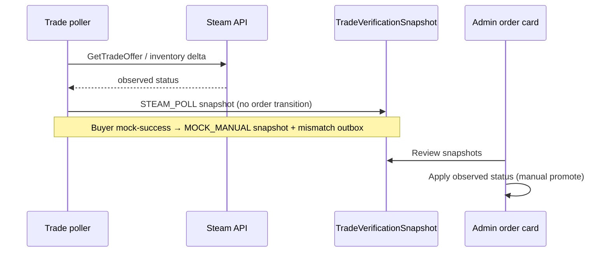

# Phase 4.4 — Shadow Mode

**Module:** 4.4  
**Status:** Closed (code + automated tests)  
**Staging gate:** 5+ real poll orders with 0 unintended status changes; mismatch → admin notification

---

## Overview

Real Steam trade verification runs in the background, but poll results **do not** auto-update order status or ledger. Operators compare Steam observations against mock/manual expectations before promoting status.

Requires Phase 4.3 (`TRADE_PROVIDER=steam`, poller active).

---

## Environment

| Variable | Default | Description |
|----------|---------|-------------|
| `TRADE_VERIFICATION_MODE` | `live` | Set to `shadow` for dry-run verification |
| `ENABLE_REAL_SETTLEMENT` | `false` | **Must** be `false` in shadow mode (validated at poller startup) |
| `ENABLE_MOCK_TRADE` | `true` | Allows mock-complete for side-by-side comparison |
| `TRADE_PROVIDER` | `mock` | Must be `steam` for real poll snapshots |

Legacy alias: `STEAM_POLL` → `live`.

---

## Flow

1. Order created → `TradeOperation.verificationMode = SHADOW`
2. **Steam poller** calls real Steam API, writes `TradeVerificationSnapshot` (`STEAM_POLL`), does **not** transition order status
3. **Mock-complete** in shadow writes `MOCK_MANUAL` snapshot only — no ledger or status change
4. **Comparator** sets `match`; mismatch emits `TRADE_SHADOW_MISMATCH` outbox → admin notifications
5. **Admin** applies observed status on order card → `TRADE_CONFIRMED` / fail / dispute (no auto-settlement unless `ENABLE_REAL_SETTLEMENT=true`)



---

## API

| Method | Path | Auth | Description |
|--------|------|------|-------------|
| GET | `/auth/config` | Public | Includes `tradeVerificationMode` |
| POST | `/admin/orders/:id/apply-observed-status` | Admin | Promote order from latest `STEAM_POLL` snapshot |
| GET | `/admin/metrics/shadow` | Admin | `{ mismatchesLast7d }` |

Order card includes `verificationSnapshots[]` when `verificationMode = SHADOW`.

---

## UI

| Route | Purpose |
|-------|---------|
| `/admin/orders/:id` | Shadow snapshots table + **Apply observed status** |
| Order page (buyer) | Mock trade panel remains visible in shadow mode |

---

## Metrics

`GET /health/metrics`:

```json
{
  "tradeShadow": {
    "trade_shadow_mismatch_total": 2
  }
}
```

---

## Rollback

Switch to live or off mode without provider rollback:

```env
TRADE_VERIFICATION_MODE=live
# or
TRADE_VERIFICATION_MODE=off
```

Full mock rollback: see [phase-4-steam.md](./phase-4-steam.md).

---

## Tests

| Layer | What |
|-------|------|
| Unit | `trade-verification.config.spec.ts`, `trade-shadow-comparator.service.spec.ts` |
| E2E backend | `test/shadow-mode.e2e-spec.ts` (SHADOW mode, mock snapshot, apply observed, metrics) |
| E2E frontend | Admin order card shadow section (via ops flows) |
| Manual staging | Real offer + poll → snapshot only, no status drift |

```bash
cd backend && npm test && npm run test:e2e -- shadow-mode
cd frontend && npm run lint && npm run build
```

---

## Gate 4.4 checklist

| Criterion | Automated | Staging |
|-----------|-----------|---------|
| SHADOW verification mode on order | ✅ backend e2e | manual |
| Poll writes snapshot, no status change | ✅ backend e2e + poller code | 5+ real orders |
| Mock-complete records MOCK_MANUAL only | ✅ backend e2e | manual |
| Mismatch → outbox + admin notification | ✅ backend e2e | manual |
| Apply observed status (no ledger in shadow) | ✅ backend e2e | manual |
| Shadow metrics dashboard | ✅ backend e2e | manual |
| `ENABLE_REAL_SETTLEMENT=true` rejected in shadow | ✅ unit | flip env |

---

## Related

- [Phase 4.3 — Trade Status Check](phase-4-trade-poll.md)
- [Phase 4.5 — Limited Real Settlement](phase-4-settlement.md)
- [Phase 4 — Rollout & Rollback](phase-4-steam.md)
