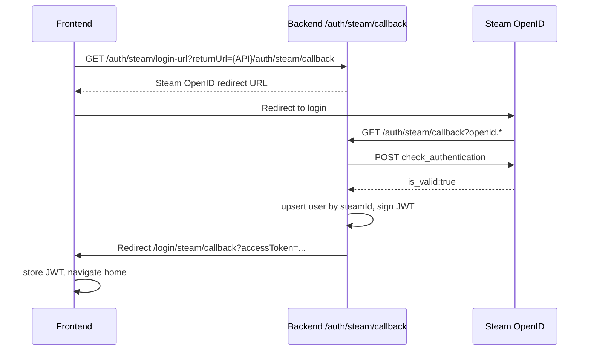

# Phase 4.1 — Steam Auth

**Module:** 4.1  
**Status:** Implemented  
**Gate:** Staging — 3+ successful OpenID logins; JWT + `GET /inventory` with linked `steamId`; rollback via `AUTH_PROVIDER=mock`

---

## Identity model

**Chosen path (MVP):** `User.steamId` (unique, nullable).

- One Steam account maps to one user row via `steamId`.
- New Steam login → upsert user (`role: BUYER`, wallet via `ledger.ensureUserWallet`).
- Existing `steamId` → login (username updated when `STEAM_WEB_API_KEY` is set).

**Deferred:** `UserIdentity { userId, provider, externalId, linkedAt }` — only needed for mock→Steam account merge without collapsing two user records. Out of scope for 4.1.

---

## Flow

---

## Endpoints

| Method | Path | Auth | Description |
|--------|------|------|-------------|
| GET | `/auth/steam/login-url?returnUrl=` | Public | Build Steam OpenID redirect URL |
| GET | `/auth/steam/callback` | Public | Verify OpenID, upsert user, redirect to frontend with JWT |
| POST | `/auth/steam/link` | Bearer JWT | Link Steam to current user (`409 STEAM_ALREADY_LINKED` if taken) |
| POST | `/auth/mock-login` | Public | Disabled when `AUTH_PROVIDER=steam` unless `ALLOW_MOCK_LOGIN_IN_STEAM_MODE=true` |

---

## Environment

| Variable | Required | Description |
|----------|----------|-------------|
| `AUTH_PROVIDER` | Yes | `mock` (default) or `steam` |
| `STEAM_OPENID_REALM` | Steam mode | Must match deployment API origin (e.g. `https://api.example.com/api/v1`) |
| `STEAM_WEB_API_KEY` | No | Fetch Steam persona name on login |
| `FRONTEND_ORIGIN` | Yes | Callback redirect target (e.g. `https://app.example.com`) |
| `ALLOW_MOCK_LOGIN_IN_STEAM_MODE` | No | `true` to keep mock login in steam mode (dev only) |

---

## Error codes

| Code | HTTP | When |
|------|------|------|
| `STEAM_AUTH_FAILED` | 401 | OpenID verification failed or invalid `claimed_id` |
| `STEAM_ALREADY_LINKED` | 409 | Link: `steamId` belongs to another user |
| `STEAM_PROFILE_PRIVATE` | Reserved | Future inventory/profile gates |

---

## Rollback

Set `AUTH_PROVIDER=mock` and restart backend. Mock E2E and `POST /auth/mock-login` work unchanged.

---

## Tests

- Unit: `backend/src/providers/auth/steam-openid.util.spec.ts`, `steam-auth.provider.spec.ts`
- Manual staging: `scripts/steam-login-smoke.ts`
- Mock E2E: unchanged (`AUTH_PROVIDER=mock` in Playwright config)
