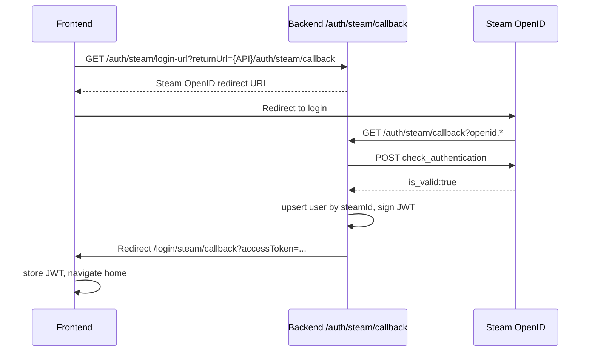

# Phase 4.1 — Steam Auth

**Module:** 4.1  
**Status:** Closed (code + automated tests)  
**Staging gate:** 3+ successful OpenID logins on a real deployment; rollback verified

---

## Identity model

**Chosen path (MVP):** `User.steamId` (unique, nullable).

- One Steam account maps to one user row via `steamId`.
- New Steam login → upsert user (`role: BUYER`, wallet via `ledger.ensureUserWallet`).
- Existing `steamId` → login (username updated when `STEAM_WEB_API_KEY` is set).
- **Link flow:** mock/dev user links Steam without creating a new account (`GET /auth/steam/link-url`).

**Deferred:** `UserIdentity` table — only needed for mock→Steam merge without collapsing users.

---

## Flows

### Sign in with Steam



### Link Steam to existing account

1. User logged in (e.g. mock seller in dev with `ALLOW_MOCK_LOGIN_IN_STEAM_MODE=true`).
2. `/account` → **Link Steam account** → `GET /auth/steam/link-url` (Bearer JWT).
3. Backend embeds signed `link_state` (10 min JWT) in `return_to`.
4. Same OpenID callback → links `steamId` to current user → redirect with `linked=1`.

Alternative: `POST /auth/steam/link` with `openidParams` (API clients).

---

## Endpoints

| Method | Path | Auth | Description |
|--------|------|------|-------------|
| GET | `/auth/steam/login-url?returnUrl=` | Public | Build Steam OpenID redirect URL |
| GET | `/auth/steam/link-url` | Bearer JWT | Link flow: Steam URL with signed `link_state` |
| GET | `/auth/steam/callback` | Public | Verify OpenID, login or link, redirect to frontend |
| POST | `/auth/steam/link` | Bearer JWT | Link Steam via `openidParams` body |
| POST | `/auth/mock-login` | Public | Disabled when `AUTH_PROVIDER=steam` unless `ALLOW_MOCK_LOGIN_IN_STEAM_MODE=true` |

---

## UI routes

| Route | Purpose |
|-------|---------|
| `/login` | Mock / Steam tabs (config-driven) |
| `/login/steam/callback` | Parse JWT from redirect query |
| `/account` | Profile, Steam ID, link button |

---

## Environment

| Variable | Required | Description |
|----------|----------|-------------|
| `AUTH_PROVIDER` | Yes | `mock` (default) or `steam` |
| `STEAM_OPENID_REALM` | Steam mode | API origin without path, e.g. `http://localhost:3000` |
| `API_PUBLIC_URL` | No | Full API base, e.g. `http://localhost:3000/api/v1` (defaults from realm) |
| `STEAM_WEB_API_KEY` | No | Fetch Steam persona name on login |
| `FRONTEND_ORIGIN` | Yes | Callback redirect target |
| `ALLOW_MOCK_LOGIN_IN_STEAM_MODE` | No | `true` to keep mock login in steam mode (dev only) |

---

## Error codes

| Code | HTTP | When |
|------|------|------|
| `STEAM_AUTH_FAILED` | 401 | OpenID verification failed or invalid `claimed_id` |
| `STEAM_ALREADY_LINKED` | 409 | Link: `steamId` belongs to another user |
| `STEAM_PROFILE_PRIVATE` | 400 | Inventory: Steam profile/inventory is private (Phase 4.2) |

---

## Rollback

```bash
AUTH_PROVIDER=mock
# restart backend
```

Mock E2E and `POST /auth/mock-login` work unchanged.

---

## Tests

| Layer | What |
|-------|------|
| Unit | `steam-openid.util.spec.ts`, `steam-auth.provider.spec.ts`, `steam-profile.service.spec.ts`, `users.service.spec.ts` |
| E2E backend | `test/steam-auth.e2e-spec.ts` (callback, link-url, conflict) |
| E2E frontend | `e2e/steam-callback.spec.ts` (callback page, no live Steam) |
| Manual staging | `scripts/steam-login-smoke.ts` |

```bash
cd backend && npm test && npm run test:e2e
cd frontend && npm run lint && npm run build && CI=true npm run test:e2e
```

---

## Gate 4.1 checklist

| Criterion | Automated | Staging |
|-----------|-----------|---------|
| OpenID verify + upsert | ✅ backend e2e | 3+ real logins |
| Link existing user | ✅ backend e2e | optional |
| JWT + inventory API | ✅ smoke script | manual |
| Frontend callback | ✅ Playwright | manual |
| Rollback to mock | ✅ docs + config | flip env |

---

## Next

**Phase 4.3 — Real Trade** (`TRADE_PROVIDER=steam`)
